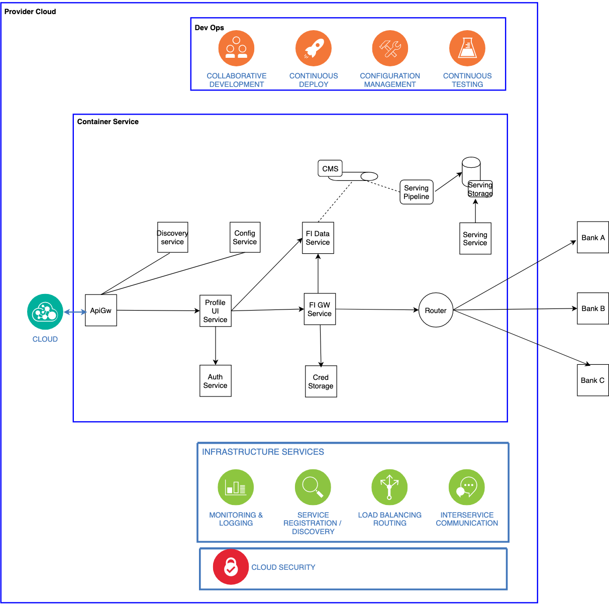

# High Level Design of FDP

##  Scalibility
Every micro service in the FDP ecosystem has different throughput and latency requirement.Each service is deployed as a set of service instance to achieve the desired availability and throughput.
Each service is packaged as a Docker image and each service instance is a Docker Container. Cloud provider specific cluster management solution like GCP kubenetes solution can be used to deploy the services.

## API Communication
FDP platform is a higly decoupled system where each of the micro service talks to upstream services through some kind of network protocol(http/grpc) with 
binary (protpbuf) or text encoding of payload(json). All external integration with the user application , or FI integration will be done using  the API Gateway. API gateway is going to centralize the cross cutting needs (access log , rate limiting , ssl termination, trace generation)

## Service Discovery
Standard service registration and discovery mechanism will be employed for service to lookup upstream services and do client side loadbalancing.

## Caching

FI service is the primary storage of the Financial Data Providers meta data. FIGW service uses the meta data to route data access to different providers.
The meta data for FI data providers can be cached in a cache storage(REDIS)

## Reliability
### Circuit Breaking
Will be applied to handle outage on upstream services

### Automatic Retry
Certain service failure (5xx) can be retried on the upstream api with a backoff strategy. Hystrix or Resilency4j provide library based solution for circuit break and
retry.

## Security
All access to the system will be via jwt tokens issues by the authentication service and validated in the api gateway.
For service to service communication tokens with correct scoping should be generated via the authentication service client credential grant mechanism.

### Storage of client access tokens/password 
Since the FDP platform will be accessing data on behalf of the user standard Oauth2 grant(authorization code grant) will be employed to access user data.If the Data provider provides mechanism for standard oauth users consent on data access should be done. Accesstoken/Refresh token pair should be used for pulling data and Refreshing token pair on expiry. Accesstoken and refresh token should be protected via data protection and encryption service.
In Case the Data Provider does not support Oauth but uses user/password based login to pull data . Users implicit consent should be taken upfront on the usage and access of data. The userid and password used for accessing data should be put in encypted stored and should be accessed via encryption/decryption service.

### Securing api channel
All external communication with Application and Data provider will be done over ssl. Service to Service communcation can be secured with mutual tls.

## Observability
### Logging 
API gateway provides access logs which can be streamed to a index and search system (elastic search and kibana)

### API Health Check 
Cloud based monitoring tool(newrelic) can be used to push service level metrics. Usually a monitoring solution provides library to integrate
with the service code for providing instrumentation.

### Audit 
Access to cluster by humans or services can be audited by shipping audit logs (syslog) to auditing system(indexed via elastic and served via kibana)

### Alerting 
Cloud based monitoring tools(newrelic) provides alerting mechanism on top of the service metrics. Latency/Throughput/Appdex violations can trigger alerts.
Newrelic provides integration with  Slack , Pagerduty to on SLA viotation.

### Service Metrics 
All functional and app level metrics (failures counts , success count etc) can be send to a timeseries db(influxdb). Statds provides udp based clients which can be integrated into the service to collect service metrics. Reporting and alerting dashboards can be configured on grafana.

### Service logs 
Service logs can be shipped via standard log mining agents (fluentd agents) and pushed to indexer(elastic search)
