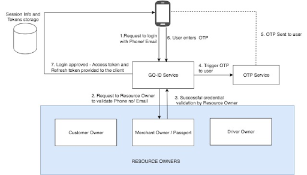
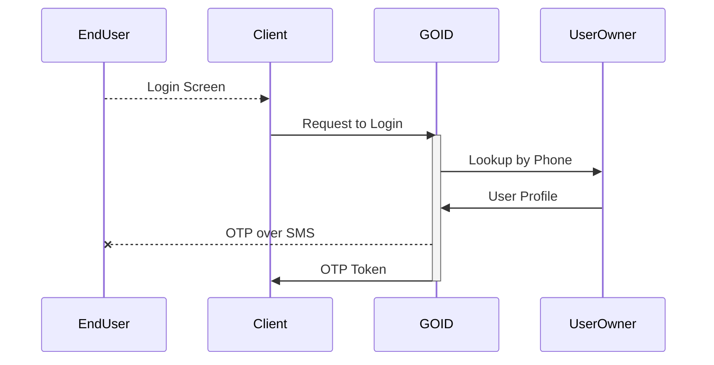
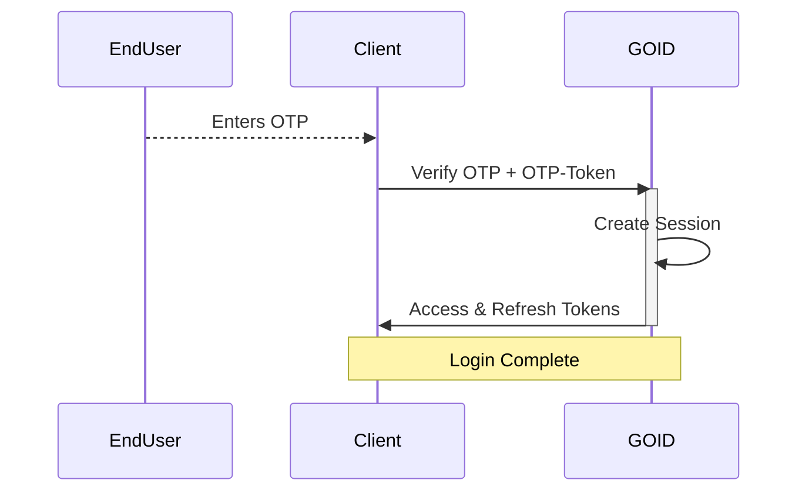
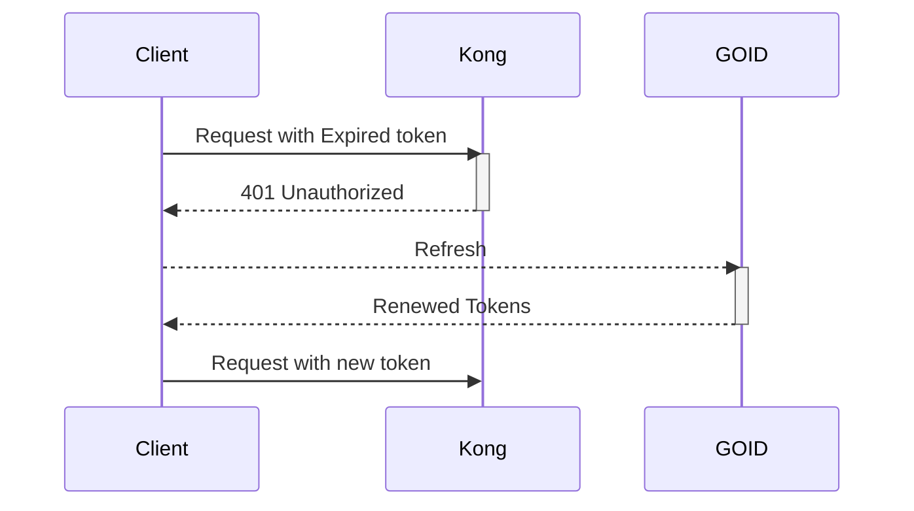
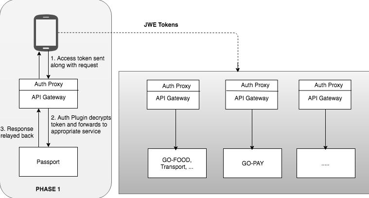
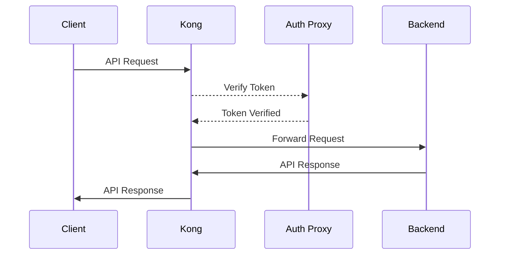

# GOID Architecture
GOID is a token generation service for allowing api access to clients where the token validation happens in a decentralized way.

## GOID Service Overall Design

## Request to Login

In this step, Client makes a request to GOID for an OTP to log in the user.

## Grant Token

In this step, user enters the OTP and the client makes a request to GOID to verify
and get access and refresh tokens.

## Refreshing Tokens

After receiving the tokens, `Access Token` can be used to make API calls to GOJEK
backend services. `Access Token` is valid only for a configured duration and after
the expiry, the `Refresh Token` should be used to renew the `Access Token`. Client
should try a refresh call to GOID when it receives `401 Unauthorized` from Kong.

## GOID Auth Proxy
GOID Auth Proxy is responsible for verifying the access token and scopes from one of
the known headers during an API call. It is deployed with the API Gateway (i.e., Kong)
as a sidecar or as a plugin.

## Token validation and API access

