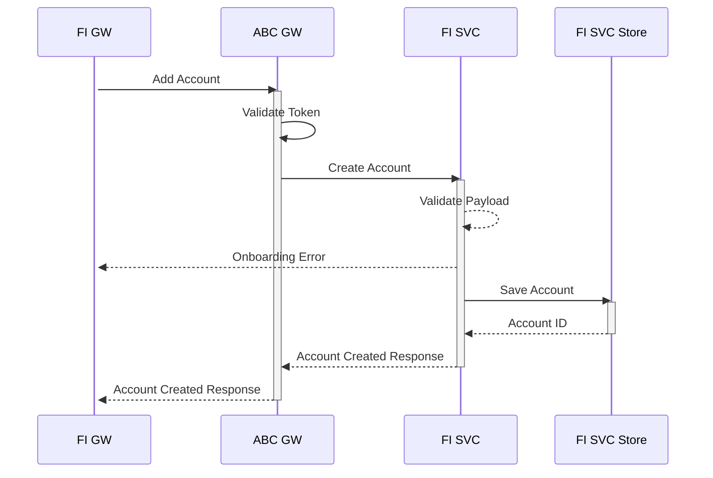
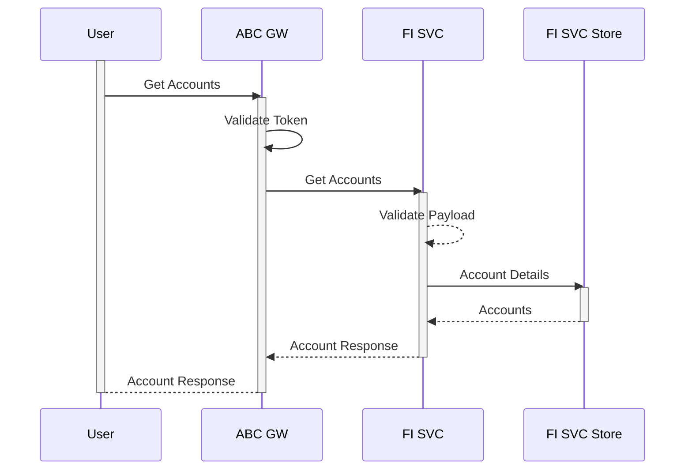
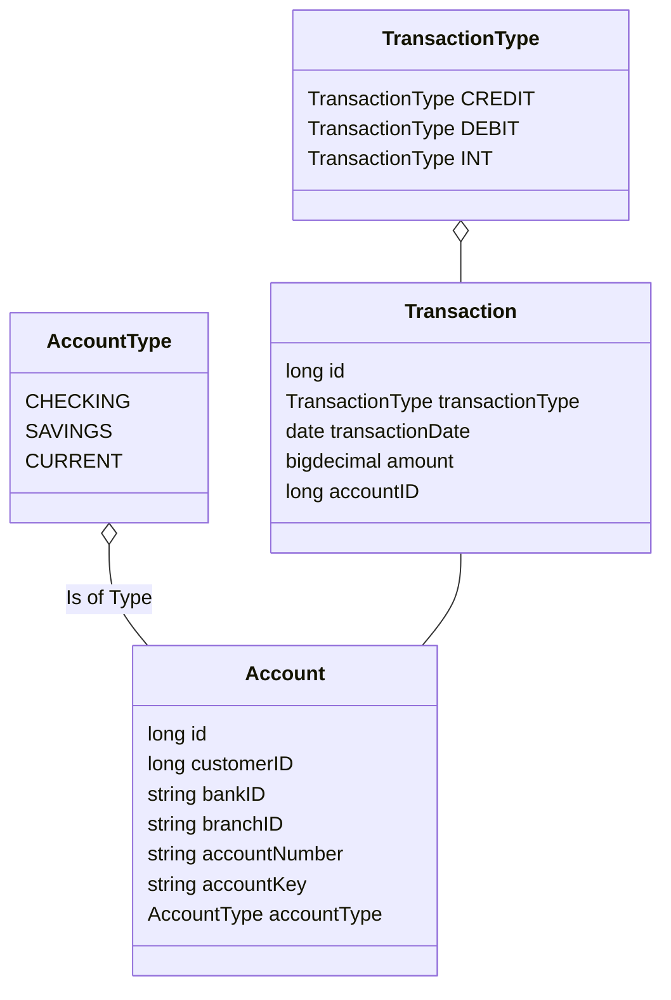

# FI Account Onboarding
All users of FDP should be able to pull in account details from a finanicial data provider which has onboarded to FDP.
First step of data extraction from a Data Provider is to link the User Account with the FDP. The part of the linking
is to retrieve and store users credential for doing further data extraction.
FI Service stores the information for the user to account linking

## Add Account 
Create a link between the account on FDP side with the account on financial data provider with ABC.

!!! abstract "Link Account"



!!! abstract "Example Link Account"

```
curl  -XPOST http://localhost:8060/fi-service/account/4 
  -d '{
        "customerID" : 4 , 
        "bankID" : 4 , 
        "accountNumber" : 4001 , 
        "accountType" : "SAVINGS" 
      }' 
  -H "Content-Type: application/json" -H "Authorization: Bearer <System Access Token>"
```

##Account Details
User Linked account details 

!!! abstract "Linked Account Details"



!!! abstract "Linked Account Details"

```
curl  -XPOST http://localhost:8060/fi-service/account/4 
      -H "Content-Type: application/json" -H "Authorization: Bearer <User Access Token>"
```

## Delete Account 
User can choose to delink an account sync for a particular service provider. The financial gateway will trigger an unlink  with the financial data provider
post that the fi service should remove the link from the db. Messages should also be propogated to the service layer to delete the account mapping.

!!! abstract "UnLink Account"

```mermaid
sequenceDiagram

participant FI GW
participant ABC GW
participant FI SVC
participant FI SVC Store
participant Intg GW

activate FI GW
FI GW ->> ABC GW: Delete Account 
activate ABC GW
ABC GW ->> ABC GW: Validate Token
ABC GW ->> FI SVC: Delete Account
activate FI SVC
FI SVC ->> FI SVC: Validate Payload
FI SVC -->> FI GW: Onboarding Error
FI SVC ->> FI SVC Store: Delete Account
activate FI SVC Store
FI SVC Store -->> FI SVC: Delete Account ID
deactivate FI SVC Store
FI SVC -->> Intg GW: Account Delete Msg
FI SVC -->> ABC GW: Account Deleted Response
deactivate FI SVC
ABC GW --> FI GW: Account Deleted Response
deactivate ABC GW
deactivate User
```

!!! abstract "Example Delete Linked Account"

```
curl  -XDELETE http://localhost:8060/fi-service/account/{cust_id}/{account_id}
  -d '{
        "customerID" : 4 , 
        "bankID" : 4 , 
        "accountNumber" : 4001 , 
        "accountType" : "SAVINGS" 
      }' 
  -H "Content-Type: application/json" -H "Authorization: Bearer <System Access Token>"
```

## Swagger Docs

http://localhost:8060/fi-service/swagger-ui.html

## Storage Diagram


## Class Diagram

!!! abstract "Account Transaction"


