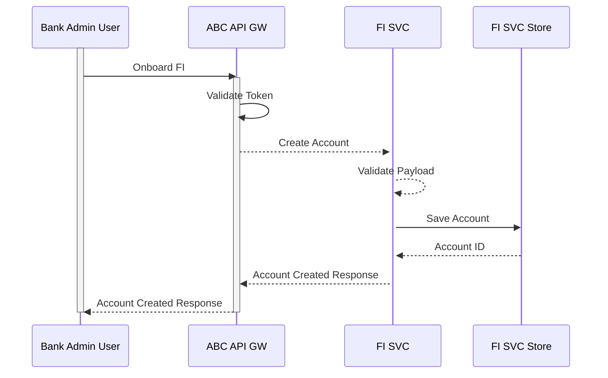
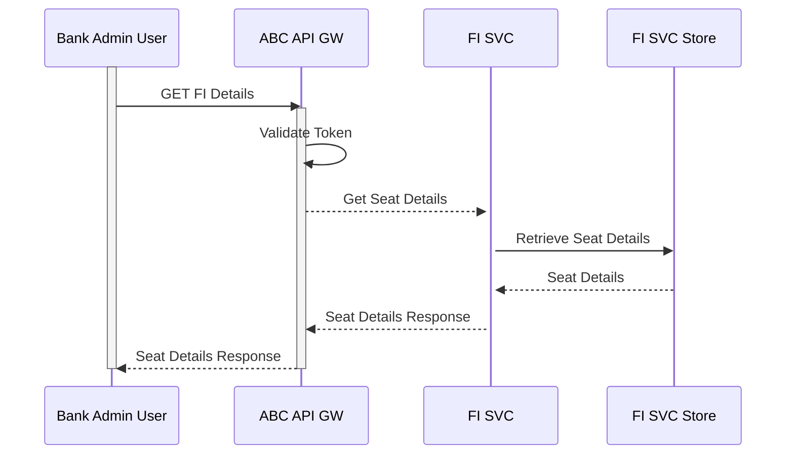
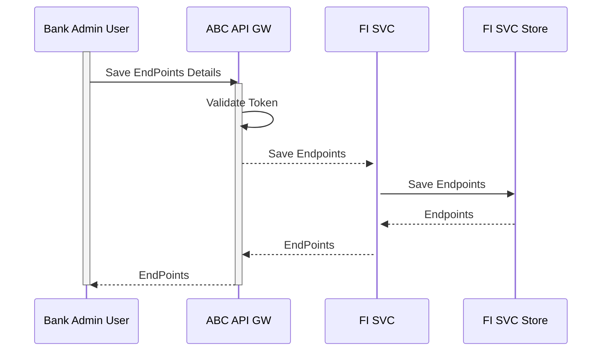
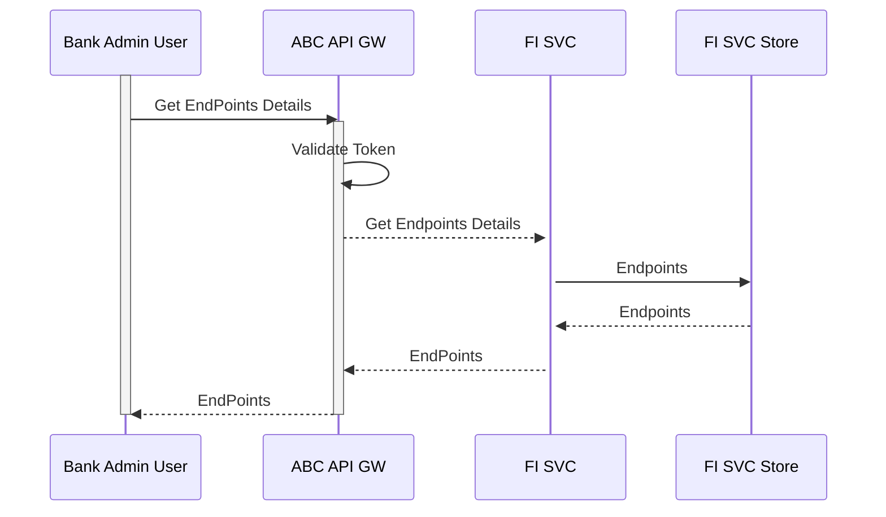
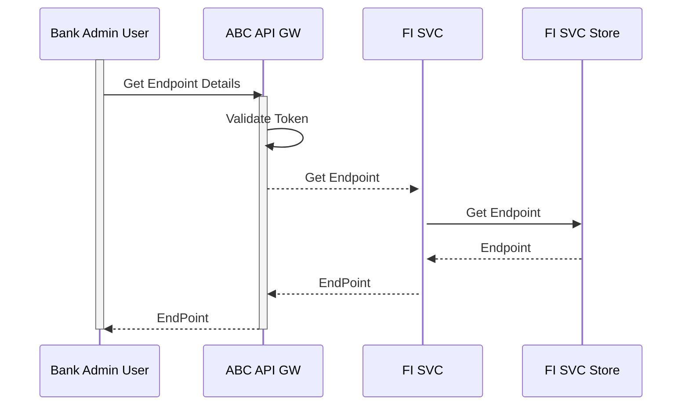
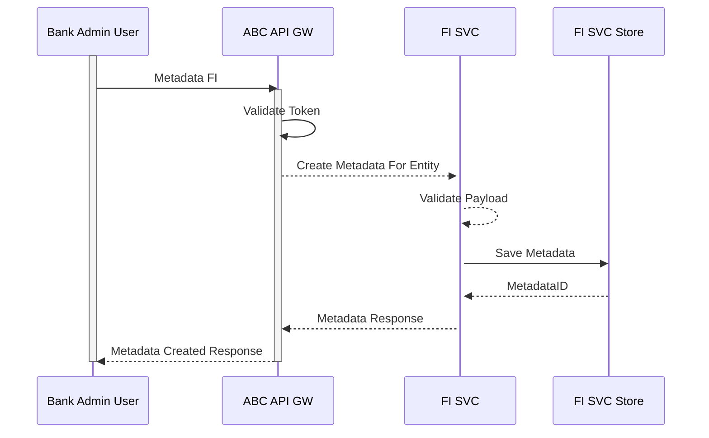
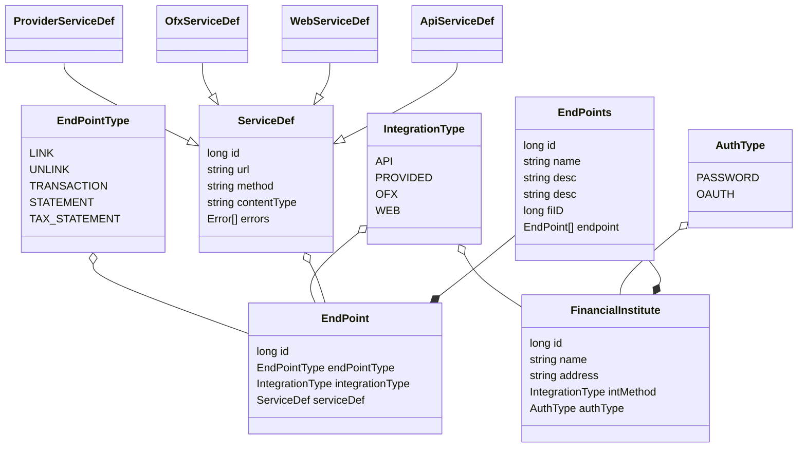

# FI Seat Management
Offline process should provide client credential for the bank to use the credential for Seat Management.Standard oauth access token with admin scope should be used for seat management.

##FI
Create a banking or financial instituite as a data provider with ABC.

!!! abstract "Create FI"



!!! abstract "Example Create FI"
```
curl -XPOST  http://localhost:8060/fi-service/fi 
  -d '{ "name" : "citibank" , 
        "address" :"New York" , 
        "intMethod" : "PROVIDED" , 
        "authType" : "OAUTH" 
      }' 
  -H "Content-Type: application/json" -H "Authorization: Bearer <System Access Token>"
```


!!! abstract "Update FI"
Admin user of the financial institute should be able to update details about the seat.


!!! abstract "Example Update FI"
```
curl -XPATCH  http://localhost:8060/fi-service/fi/BankA
  -d '{ 
        "address" :"New York" 
      }' 
  -H "Content-Type: application/json" -H "Authorization: Bearer <System Access Token>"
```

!!! abstract "Retrieve FI"
Admin user of the financial institute should be able to get details about the seat.



!!! abstract "Example Retrieve FI"
```
curl -XGET  http://localhost:8060/fi-service/fi/123
  -H "Content-Type: application/json" -H "Authorization: Bearer <System Access Token>"
```

## Endpoints
Admin user of the financial institute should be able to define the integration mechanism for accessing data.
Endpoint represents an access definition for a particular type of data(Account , Transaction,Statement, Tax Statement)
Endpoints represent a collection of all the Endpoint Objects. First and Endpoints collection is created and than 
Endpoint is attached to the Endpoints Collection


!!! abstract "FI Endpoints Definition"



!!! abstract "Example Create Endpoints Collection"
```
 curl  -XPOST http://localhost:8060/fi-service/fi/3/endpoints 
 -d '{
        "name" : "FI" , 
        "desc" : "fi integration" , 
        "fiID" : 3
     }' 
  -H "Content-Type: application/json" -H "Authorization: Bearer <System Access Token>"
```

!!! abstract "FI Endpoints Details"



## Endpoint

Endpoint integration mechanism for a particular entity(Account, Transaction, Statement, Tax Statement).

!!! abstract "FI Endpoint Definition"


!!! abstract "Example Create EndPoint"
```

 curl  -XPOST http://localhost:8060/fi-service/fi/3/endpoints/link  
 -d '{ 
        "endPointType" : "LINK" , 
        "type" : "API" , 
            "serviceDef" : {
               "url" : "http://localhost:9090/account", 
               "method" : "POST" 
         } 
      }'
  -H "Content-Type: application/json" -H "Authorization: Bearer <System Access Token>"
 ' 
```

!!! abstract "FI Endpoint Retrieve"



##FI Metadata
ABC has a set of Entities which does not exactly match to the similiar entities on the Data Provider.
Matadata is a translation information between ABC and Data Provider. The Dataprovider as part of their
onboadring to the FDP platform should add this translation.This is self serve.

!!! abstract "Create Meta for FI"



!!! abstract "Example Create FI"
```
curl  -XPOST http://localhost:8060/fi-service/fi/3/metadata 
-d '{ 
      "fiID" : 3 , 
      "objectType" : "Transaction" , 
      "fields" : {
          "type" : "type", 
          "transactionDate" : "transactionDate" , 
          "id" : "id" , 
          "accountID": "accountID", 
          "bankID" : "bankID"
      } 
    }' 
  -H "Content-Type: application/json" -H "Authorization: Bearer <System Access Token>"
```


## Swagger Docs

http://localhost:8060/fi-service/swagger-ui.html

## Storage Diagram


## Class Diagram

!!! abstract "Account Metadata"




