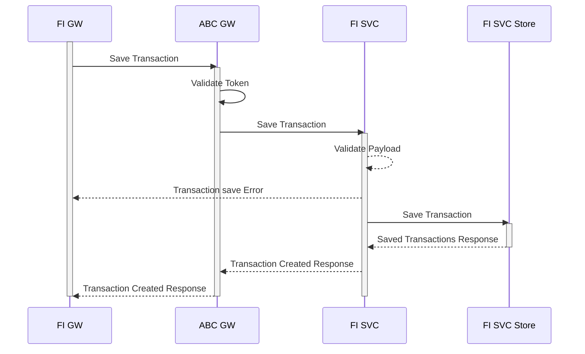
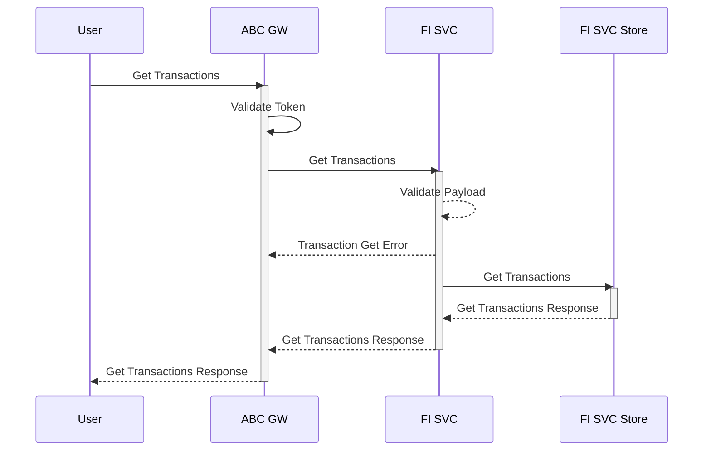

# FI Transactions
All users transactions in  FDP should be able stored in the FI service. FI service should serve the transaction data for dashboard service.
The transaction endpoints should be used by the Financial Data Providers to push transaction data in realtime. The transaction endpoint should work 
as a webhook for Data Providers to push data in realtime for more upto date data management.

## Create Transaction 
FI GW on successful pulling of transaction data will push the data to FI Service

!!! abstract "Save Transactions"

## Get Transactions
User Dashboard or the serving layer of FDP can pull transation date from FI Service

!!! abstract "Get Transactions"

