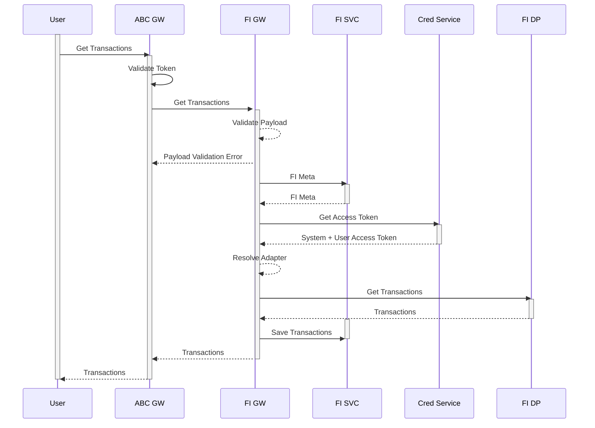

# FI Transaction import
All users transactions in  FDP need to be pulled from a Financial data provider.Financial Data Provider during its onboarding has
provide details of Endpoints and also Metadata of the objects. As part of the account linking the FIGW should pull the Credential
needed to pull data from the Financial Data Provider. The credential need to be securedly stored in a cred service backed by a data vault.
Data sync can be initiated by the user , schedule or via webhooks. Webhooks can be a recommended way for more accurate and reatime data sync.
The financial data provider should access the webhook to post realtime updates to user account.

## Create Transaction 
FI GW on successful pulling of transaction data will push the data to FI Service

!!! abstract "Save Transactions"

