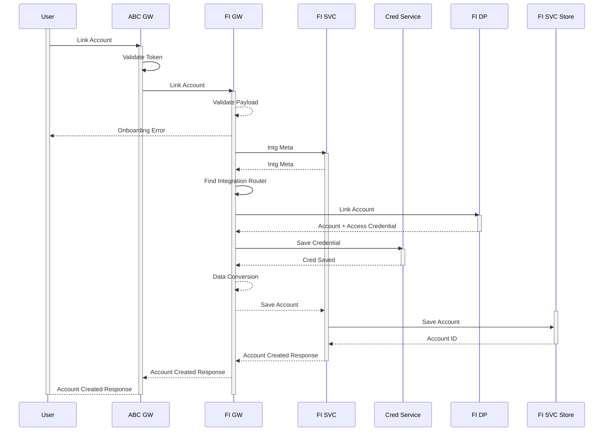
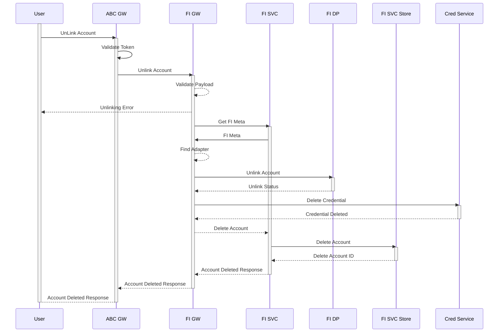

# FI Account Onboarding
All users of FDP should be able to pull in account details from a finanicial data provider which has onboarded to FDP.
First step of data extraction from a Data Provider is to link the User Account with the FDP. The part of the linking
is to retrieve and store users credential for doing further data extraction.


## Security 
For all link , unlink  , data import calls the users credential is to be provided to the Financial Data Provider. Suggested ABC install a cred service to
securely store user cred (password/access token). Cred Service can install a vault to securely store  user credential. Also ABC should establish its credential
with the Financial Data Provider . Offline ABC should onboard on to the Financial Data Provider by a ouath clieent credential method. All calls should provide the Aceestoken
provided by client credential grant to access data securedly .

## Linking Account 
Create a link between the account on FDP side with the account on financial data provider with ABC.

!!! abstract "Link Account"



!!! abstract "Example Link Account"

```
curl  -XPOST http://localhost:8060/figw-service/fi/{fiid}/account/{accountID} 
  -d '{
        "usercred" : <> , 
        "bankID" : 4 , 
        "accountNumber" : 4001 , 
        "accountType" : "SAVINGS" 
      }' 
  -H "Content-Type: application/json" -H "Authorization: Bearer <System Access Token>"
```


## UnLinking Account 
User can choose to delink an account sync for a particular service provider.

!!! abstract "UnLink Account"



!!! abstract "Example Delete Linked Account"

```
curl  -XPOST http://localhost:8060/figw-service/fi/{fiid}/account/{accountID} 
  -d '{
        "customerID" : 4 , 
        "bankID" : 4 , 
        "accountNumber" : 4001 , 
        "accountType" : "SAVINGS" 
      }' 
  -H "Content-Type: application/json" -H "Authorization: Bearer <System Access Token>"
```
