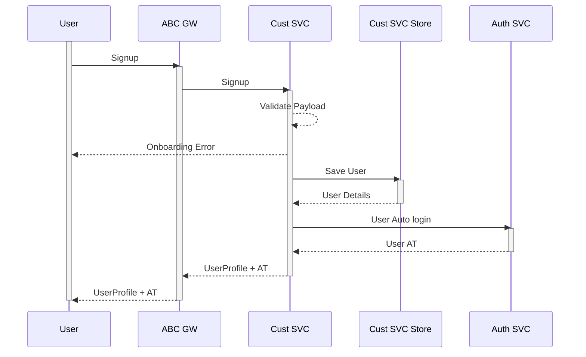
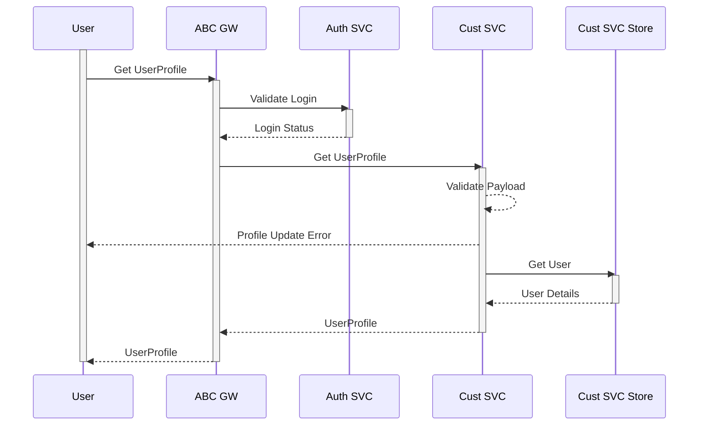
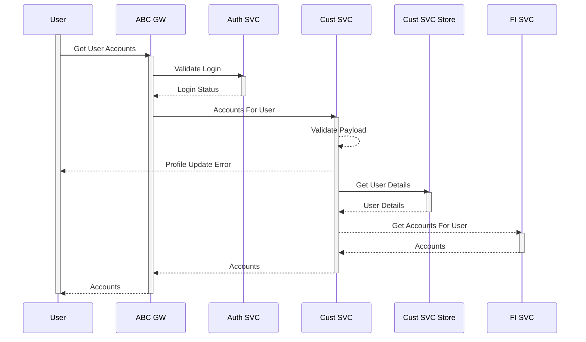
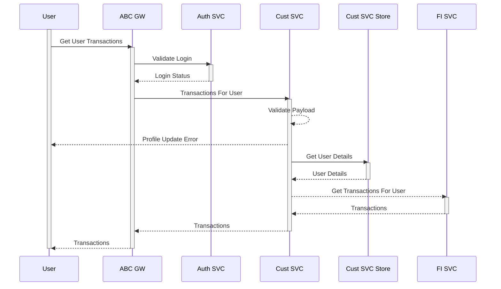

# Customer Onboarding 
Users can onboard to FDP via self signin , this module should also serve the user dashboard service.
User should be able to initiate account lookup and data import export via this service.

## User Signup

!!! abstract "User Signup"

## Update User

!!! abstract "Update User"

## Retrieve UserProfile
Logged in User will retrieve the user details

!!! abstract "User Profile"

## User Data Management
User Data Management is about linking the user account in ABC with the other financial data provider.
Its also about triggering new data import into FDP initiated by the user. The facility for linking account, importing data into 
ABC is provided in FI micro service. UserManagement module can be function as user dashboard service which enableds to initiate 
data aggregation for multiple Data Providers.

!!! abstract "User Accounts"

!!! abstract "User Transactions"

